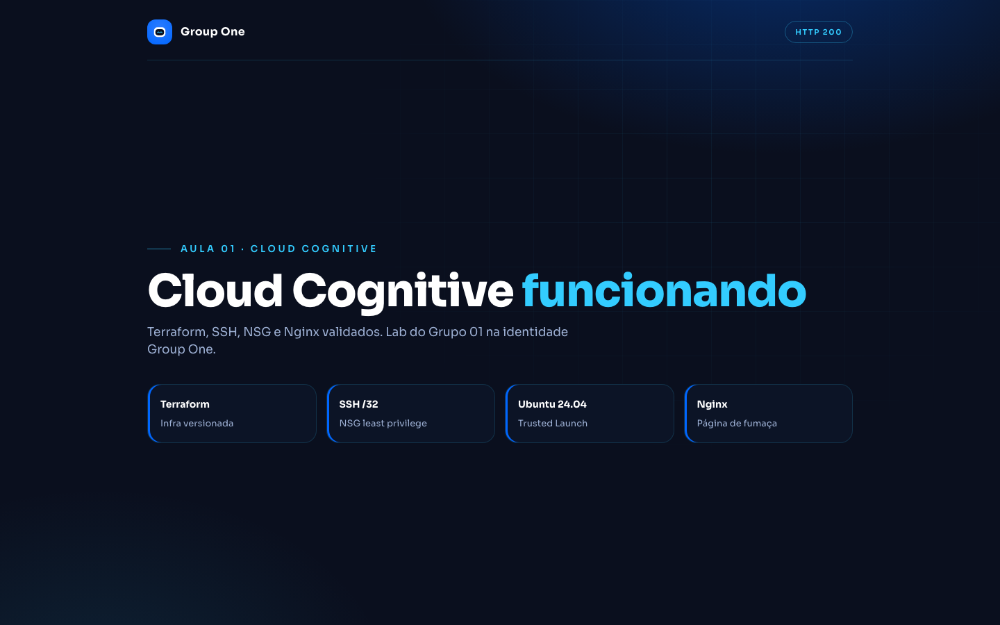

# Evidências de provisionamento — Aula 1

**Data da validação:** 10/08/2026  
**Assinatura:** Azure for Students  
**Resource Group:** `rg-cloud-cognitive-aula01`

## Restrições encontradas

1. A policy `Allowed resource deployment regions` bloqueou `eastus2`.
2. A região `eastus` era permitida, mas não tinha capacidade para
   `Standard_B2s`.
3. O cruzamento entre regiões permitidas, quota e capacidade indicou
   `chilecentral` com `Standard_B2als_v2`.

Configuração aplicada:

| Item | Valor |
|---|---|
| Região | `chilecentral` |
| VM | `vm-cc-aula01` |
| SKU | `Standard_B2als_v2` — 2 vCPUs, 4 GB |
| Imagem | Ubuntu 24.04 LTS x64 |
| Segurança | Secure Boot + vTPM |
| IP público após recriação | `57.156.58.166` |
| SSH | TCP/22 restrito ao IP do executor em `/32` |

## Ciclo completo

```text
Destroy complete! Resources: 9 destroyed.
resource_group_absent=true

Plan: 9 to add, 0 to change, 0 to destroy.
Apply complete! Resources: 9 added, 0 changed, 0 destroyed.
public_ip_address = "57.156.58.166"
```

## Estado Azure

```json
{
  "location": "chilecentral",
  "name": "vm-cc-aula01",
  "os": "ubuntu-24_04-lts",
  "powerState": "VM running",
  "provisioningState": "Succeeded",
  "secureBoot": true,
  "size": "Standard_B2als_v2",
  "vTpm": true
}
```

## SSH / Nginx

`scripts/validate-nginx.sh`:

```text
ssh=ok
http=200
url=http://57.156.58.166/
```

HTTP 200 na página Group One (`nginx/index.html`):



Fonte: [`nginx/index.html`](../nginx/index.html).

## Alteração isolada da regra SSH

`terraform plan` com `meu_ip=203.0.113.10` (TEST-NET) alterou só o NSG:

```text
# azurerm_network_security_group.vm will be updated in-place
~ resource "azurerm_network_security_group" "vm"
Plan: 0 to add, 1 to change, 0 to destroy.
```

A VM não entrou no plano. O IP real do executor fica só em `TF_VAR_meu_ip` (não versionado).

## Idempotência

```text
No changes. Your infrastructure matches the configuration.
```

## Limpeza final

```text
Destroy complete! Resources: 9 destroyed.
az group exists -n rg-cloud-cognitive-aula01 → false
```
