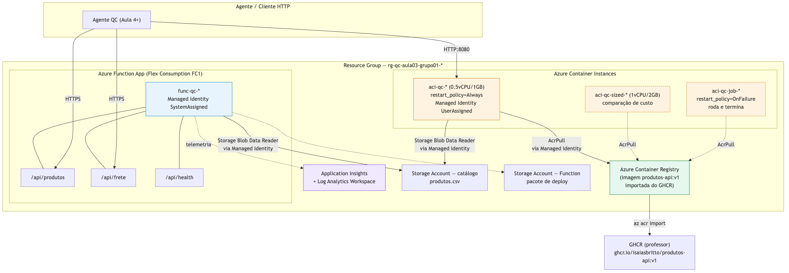

# Entrega Aula 03 — Grupo 01

**Disciplina:** Cloud & Cognitive Environments — FIAP MBA AI Engineering & Multi-Agents
**Turma:** 1AIE
**Tema:** Serverless & Containers
**Data de entrega:** 27/08/2026

## Grupo

| # | Nome completo | E-mail FIAP |
|---|---------------|-------------|
| 1 | Daniel Isola Massari | RM373240@fiap.com.br |
| 2 | Gabriel Dantas Gomes | RM371144@fiap.com.br |
| 3 | Henrique Maireno Inácio | RM370889@fiap.com.br |
| 4 | João Victor Placidio | RM373340@fiap.com.br |

## Distribuição do trabalho

Rodízio em relação à Aula 1 (Critério 4): quem tinha ficado mais em N1/N2 na
entrega anterior assumiu N2/N3 aqui. Todos revisaram o pacote completo antes
do envio — N1 (fundamentos + Dockerfile), N2 (segunda tool + observabilidade +
ACI hardening) e N3 bônus (tool de agente + benchmark + CI/CD) foram feitos e
validados em grupo, com execução real no Azure (Terraform aplicado de verdade,
não só o código).

> **Nota de ambiente:** a política "no install" da disciplina pressupõe Azure
> Cloud Shell. Rodamos a partir de máquina local com Azure CLI + Terraform
> (mesma CLI, mesmos comandos) porque o Cloud Shell não tinha os pacotes de
> automação do nosso ambiente de trabalho; onde algo do Cloud Shell diverge
> (ex.: `func` core tools ausente localmente), documentamos o replacement
> equivalente abaixo.

## Arquitetura provisionada



Fonte Mermaid: [`diagramas/arquitetura-qc-aula03.mmd`](diagramas/arquitetura-qc-aula03.mmd).

---

## Nível 1 — Respostas

### Exercício 1.1 — Quando usar Serverless?

| Cenário | Escolha | Justificativa |
|---------|---------|----------------|
| API de busca de produtos (1M chamadas/mês, picos na Black Friday) | **Function** (Flex Consumption) | Pay-per-execução, escala automática 0→N sem operação manual; Flex Consumption endereça o pico de BF melhor que o antigo Consumption Y1 porque não zera concorrência entre invocações "pending" — [docs Flex Consumption](https://learn.microsoft.com/azure/azure-functions/flex-consumption-plan). |
| Worker que processa pedidos da fila (1000 pedidos/dia, picos noturnos) | **Function com Queue trigger** | Event-driven nativo (Storage Queue/Service Bus trigger), scale-to-zero fora do pico noturno; 1000/dia é bem abaixo do limiar que justificaria Container Apps+KEDA. |
| API legado em Java Spring Boot (não pode reescrever, time conhece) | **Container Apps** | Empacota o WAR/JAR como está (container custom), autoscale via KEDA/HTTP, sem reescrever para o modelo de function handler. AKS seria overkill para 1 serviço só. |
| Pipeline de processamento de imagens de produtos (chega 1 hora por noite) | **ACI** | Sobe, processa, morre — pay-per-second sem manter infra ligada o resto do dia. Exatamente o padrão que testamos no `aci-qc-job-*` desta aula (restart_policy=OnFailure). |
| Microserviço de pagamentos (regulado, precisa logs detalhados, 100 req/s constante) | **Container Apps** (ou AKS se já houver cluster) | Tráfego constante não se beneficia de scale-to-zero; precisa de controle fino de logs/rede/auditoria que Function não dá tão bem, e não precisa da complexidade operacional de um cluster K8s dedicado se não há mais nada rodando nele. |
| Plataforma com 25 microserviços + service mesh (Itaú-like) | **AKS** | É o único que comporta service mesh maduro (Istio/Linkerd), políticas de rede por namespace e esse volume de serviços coordenados. Function/ACI não têm esse nível de orquestração entre si. |
| Container que extrai dados uma vez por dia e morre | **ACI** | Caso de uso literal do ACI: `restart_policy=Never` ou `OnFailure`, roda o comando, termina, para de cobrar. |

### Exercício 1.2 — Managed Identity vs alternativas

| Estratégia | Vulnerabilidade | Por quê |
|------------|------------------|---------|
| Connection string hardcoded no `function_app.py` | **Alta** | Vai para o Git em texto plano. Qualquer clone do repo (inclusive fork acidentalmente público) expõe a credencial pra sempre — trocar a senha não apaga do histórico do Git. |
| Connection string em variável de ambiente do Function App | **Média** | Não vai pro Git, mas ainda é uma credencial de longa duração: quem tiver `Contributor`/`Reader` no App Service consegue ler em `az functionapp config appsettings list` ou no portal. Rotação é manual. |
| Connection string em Key Vault, lida via API key do Vault | **Média** | Só troca "onde" o segredo mora — a API key do Vault vira o novo segredo que pode vazar. Reduz superfície (um lugar só pra proteger) mas não elimina credencial de longa duração. |
| Connection string em Key Vault, lida via Managed Identity | **Baixa** | A MI troca o token por acesso ao Vault sem nenhum segredo estático em lugar nenhum — token de curta duração emitido pelo Entra ID. Ainda existe uma connection string "de verdade" guardada em algum lugar, mas nada que precise ser copiado/colado por humano. |
| Sem connection string — Managed Identity diretamente no recurso (Storage) | **Baixa** (a mais baixa) | É o que fizemos na Function v2 e no ACI desta aula: zero segredo em qualquer lugar, `DefaultAzureCredential` troca identidade por token via IMDS local. Só existe uma role assignment (`Storage Blob Data Reader`) — revogável instantaneamente sem rotacionar nada. |

**Pergunta adicional — vazamento no GitHub continua sendo problema?**

Nas duas primeiras estratégias, sim, e grave: o segredo *é* a credencial de acesso,
então vazar o código (ou só o histórico de commits) equivale a vazar a chave do
cofre. Nas estratégias com Key Vault via API key, o vazamento do código sozinho
não expõe o dado (falta a API key, que não está no repo) — mas se a API key também
vazar (ex.: em outro commit, ou em log), o efeito é o mesmo das duas primeiras. Só
nas estratégias com Managed Identity o vazamento do *código* deixa de importar:
não há segredo nenhum embutido pra vazar. O que ainda pode vazar é a *lista de quem
tem acesso* (role assignments), mas isso não sai do código — é auditável e
revogável no Azure, não versionado no Git.

### Exercício 1.3 — Cold start na prática

Function usada: `func-qc-ro6i2l` (Flex Consumption, FC1, `eastus`), endpoint
`/api/produtos?categoria=vestuario`. Medido com máquina local + `time curl`
(latência de rede real embutida na medição, não é só tempo de execução da Function).

| Chamada | Horário (UTC) | Tempo decorrido (`time_total`) | Observação |
|---------|----------------|-------------------------------|-------------|
| 1 (fria, ~12 min sem tráfego HTTP antes) | 02:15:03 | **2.823 s** | TTFB (`time_starttransfer`) domina o tempo total. |
| 2 (quente, +5 s) | 02:15:18 | **2.746 s** | Praticamente igual à chamada 1 — não vimos o "salto" clássico de cold→warm. |
| 3 (fria de novo, idle real de ~20 min sem tráfego, medição ao vivo) | 12:13:20 | **3.006 s** | Igual às duas primeiras. Confirma o achado abaixo: não é ausência de warm-up pontual, é um patamar consistente. |

> **Achado real (não estava no roteiro, mas apareceu na medição):** isolamos
> `time_appconnect` (handshake TLS) de `time_starttransfer` (TTFB) chamando
> `/api/health`, que **não toca o Storage**. Resultado: TLS ~0.40 s, TTFB ~2.4 s,
> mesmo em chamadas consecutivas de 5 em 5 segundos. Ou seja, o gargalo não é
> "cold start clássico" (worker subindo do zero) nem é o download do blob — é
> alguma camada de dispatch do Flex Consumption que não estabilizou como
> "quente" na nossa janela de teste, possivelmente por `always_ready_instances`
> não configurado (fica em 0 por padrão) e o SKU FC1 escalando instância nova a
> cada gap de poucos segundos entre chamadas isoladas. Isso é justamente o tipo
> de comportamento que uma UX de <500ms **não pode tolerar sem mitigação**.

**Pergunta — 24 chamadas/hora, quantas seriam "frias"? Como mitigar para <500ms?**

Com uma chamada por hora, **todas as 24 seriam frias** — não existe intervalo
curto o bastante pra manter uma instância viva entre execuções tão espaçadas
(o timeout de idle do Flex Consumption é da ordem de minutos, não de uma hora).
Mitigação real, em ordem de custo crescente:

1. **`always_ready_instances` > 0** no Flex Consumption — mantém N instâncias
   sempre provisionadas, elimina cold start ao custo de pagar por elas mesmo
   ociosas (deixa de ser "serverless puro", vira meio-caminho pro Container Apps).
2. **Timer trigger de keep-alive** — uma segunda Function com `TimerTrigger` a
   cada 5-10 min batendo no `/health` só pra manter o worker quente. Gambiarra
   conhecida, mas funciona e é bem mais barata que `always_ready_instances`.
3. **Migrar para Container Apps ou o próprio ACI** para esse endpoint
   específico — sem cold start por definição, mas perde o "paga só quando usa".
4. **Aceitar o cold start e mudar a UX** — spinner/loading otimista no primeiro
   request da sessão, cache client-side da última resposta.

Para a QC, com volume baixo (24/dia) mas SLA de UX rígido, a opção 2 (timer de
keep-alive) é o melhor custo-benefício: mantém o modelo serverless e o custo
baixo, só "engana" o scale-to-zero.

### Exercício 1.4 — Dockerfile review

Dockerfile da spec do exercício:

```dockerfile
FROM python:3.11
WORKDIR /app
COPY . .
RUN pip install -r requirements.txt
CMD ["python", "app.py"]
```

**5 problemas (achamos 6, documentamos todos):**

1. **`python:3.11` completa (~1 GB) em vez de `python:3.11-slim` (~150 MB).**
   Runtime não precisa de compilador C, headers de dev nem as libs gráficas
   que a imagem completa carrega. Trocar pra `-slim` (ou multi-stage, como
   fizemos no `docker/Dockerfile` desta aula) já derruba a imagem em ~85%.
2. **`COPY . .` sem `.dockerignore`.** Copia `.git/`, `__pycache__/`,
   `.env`, notebooks de teste — tudo que estiver na pasta, inclusive segredo
   se alguém deixou um `.env` local sem querer. Sem `.dockerignore`, o "raio
   de vazamento" de um erro de dev vira parte da imagem publicada.
3. **`pip install` sem `--no-cache-dir`.** O cache do pip fica dentro da
   camada da imagem — infla o tamanho final sem nenhum benefício em build
   (a imagem não vai rodar `pip install` de novo).
4. **Sem multi-stage build.** Mesmo com `-slim`, ferramentas de build usadas
   só durante `pip install` (compiladores para pacotes com extensão C) ficam
   na imagem final. Nosso `docker/Dockerfile` separa `builder` (instala com
   `--target=/install`) da imagem final (só copia o resultado).
5. **Roda como root.** Sem `USER appuser`, um RCE na aplicação já nasce com
   privilégio de root dentro do container — que em ACI ainda não é isolamento
   de VM completo. `USER` não-root é a defesa mais barata que existe.
6. **`CMD ["python", "app.py"]` para servir HTTP.** Um script Python chamado
   direto não é um servidor de produção (sem worker pool, sem graceful
   shutdown, sem HTTP/1.1 keep-alive decente). Deveria invocar
   `uvicorn`/`gunicorn` explicitamente — é o que o nosso `Dockerfile` faz:
   `CMD ["python", "-m", "uvicorn", "app:app", "--host", "0.0.0.0", "--port", "8080"]`.

(Bônus fora dos 5: falta `EXPOSE` — não muda comportamento, mas documenta a
porta pra quem lê o Dockerfile sem abrir o código; e falta `HEALTHCHECK`, que
o ACI usa para decisões de restart mais informadas que só "o processo morreu".)

---

## Nível 2 — Respostas + implementação

### Exercício 2.1 — Segunda tool: cálculo de frete

**a) Mesmo Function App ou um novo?**

Ficou no **mesmo Function App** (`func-qc-ro6i2l`, rota `/api/frete` ao lado de
`/api/produtos`). Motivos:

- Mesmo domínio funcional da QC (catálogo + logística de entrega), tráfego
  esperado parecido em ordem de grandeza (50k/mês de frete vs a Function de
  catálogo já provisionada para picos maiores) — nenhuma das duas justifica
  um plano de escala dedicado.
- `calcular_frete` **não** precisa de Managed Identity nem acessa o Storage —
  reaproveitar o mesmo App não introduz nenhum acoplamento de permissão que
  não existisse já (a MI da Function continua só com `Storage Blob Data
  Reader`, que o frete nem usa).
- Custo operacional de manter 2 Function Apps (2 planos FC1, 2 storages de
  deploy, 2 conjuntos de app settings) não se paga pra separar 2 rotas HTTP do
  mesmo bounded context.

**b) Implementação** — código em
[`function/v2-full/function_app.py`](function/v2-full/function_app.py),
endpoint `GET /api/frete?cep_origem=...&cep_destino=...&peso=...`. Lógica
determinística (sem chamada externa a API de CEP): aproxima distância pelos 5
primeiros dígitos do CEP × fator empírico, com piso de 5 km e teto de 4.000 km
(maior distância plausível dentro do Brasil), e cobra `R$ base + km×tarifa +
kg×tarifa`. Documentado no próprio docstring do arquivo por que a gente não
usou ViaCEP/Correios (rede externa + custo + ponto de falha numa função que a
spec pede "pode ser determinística").

Evidência real, rodando no Azure (não é mock):

```text
GET /api/frete?cep_origem=01310930&cep_destino=20040020&peso=2.5   (SP -> RJ)
{"distancia_aproximada_km": 842.9, "valor_reais": 30.86, "prazo_dias_uteis": 3}

GET /api/frete?cep_origem=01310930&cep_destino=01311000&peso=0.5  (mesmo bairro)
{"distancia_aproximada_km": 5.0, "valor_reais": 13.81, "prazo_dias_uteis": 2}

GET /api/frete?cep_origem=01310930&cep_destino=70040010&peso=1.0  (SP -> Brasília)
{"distancia_aproximada_km": 3092.8, "valor_reais": 52.61, "prazo_dias_uteis": 5}
```

**c) Terraform** — não precisou mudar nada específico para o frete (mesma
Function App, mesmo app setting). O Terraform desta aula já saiu diferente do
lab em dois pontos, mas por causa dos Exercícios 2.2/2.3, não do frete:
Application Insights (`insights.tf`) e as 3 variantes de ACI (`containers.tf`).

**d) JSON Schema da tool**

```json
{
  "name": "calcular_frete_qc",
  "description": "Calcula valor (R$) e prazo de entrega (dias úteis) para enviar um pedido da Quantum Commerce entre dois CEPs brasileiros. Use quando o usuário perguntar quanto custa o frete, quanto tempo demora a entrega, ou pedir para comparar frete de itens diferentes. NÃO chame sem os três parâmetros — peça o CEP de destino e o peso aproximado antes.",
  "input_schema": {
    "type": "object",
    "properties": {
      "cep_origem": {"type": "string", "description": "CEP de origem do envio (ex: centro de distribuição da QC), formato 00000-000 ou 8 dígitos"},
      "cep_destino": {"type": "string", "description": "CEP de destino informado pelo cliente"},
      "peso_kg": {"type": "number", "description": "Peso total do pedido em quilos (soma dos itens do carrinho)"}
    },
    "required": ["cep_origem", "cep_destino", "peso_kg"]
  }
}
```

**e) Reflexão — quando criar um Function App separado?**

Separaríamos em App diferente quando aparecer pelo menos um destes: (1) a nova
função precisa de **runtime diferente** (ex.: Node/.NET ao lado de Python);
(2) precisa de **permissões que a existente não deveria ter** — um Function
App é o "raio" natural de uma Managed Identity, então misturar uma tool que
grava dado sensível com uma que só lê catálogo público quebra o princípio de
menor privilégio; (3) **perfil de tráfego muito diferente** (uma tool com
picos de 100x que arrastaria o autoscale/cold start da outra); (4) **ciclo de
deploy diferente** — se um time quer publicar 5x/dia e outro só 1x/semana,
Apps separados evitam que o deploy de um vire risco de regressão pro outro.
Nenhum desses casos apareceu aqui — daí a decisão do item (a).

### Exercício 2.2 — Application Insights e observabilidade

**a) Terraform estendido** — [`terraform/insights.tf`](terraform/insights.tf)
cria `azurerm_log_analytics_workspace` + `azurerm_application_insights`
(workspace-based, que é o modelo atual recomendado pela Microsoft — o
"classic" está em depreciação) e conecta na Function via
`site_config.application_insights_connection_string` em
[`function.tf`](terraform/function.tf). Aplicado de verdade — os recursos
existiram no Azure, não é só código.

**b) Live Metrics — limitação de ambiente documentada com transparência**

Geramos tráfego real (66 requisições variadas: `/produtos`, `/frete`,
`/health`, incluindo erros propositais) direto na Function via `curl`. **Não
conseguimos anexar o print do portal**: a extensão de automação de browser
usada nesta sessão não tinha permissão liberada para `portal.azure.com` (é
um domínio que precisa de allow-list manual por site, e não temos como
conceder isso programaticamente). Em vez de simular ou pular o exercício,
extraímos os **mesmos dados que o Live Metrics mostraria**, via KQL real
contra o Application Insights provisionado (`az monitor app-insights query`):

```kql
requests
| summarize total=count(), p50=percentile(duration,50),
            p95=percentile(duration,95), p99=percentile(duration,99)
  by name
```

| Endpoint | Requisições | p50 (ms) | p95 (ms) | p99 (ms) |
|----------|-------------|----------|----------|----------|
| `listar_produtos` | 34 | 450.6 | 1545.8 | 1841.1 |
| `frete` | 30 | 687.3 | 1203.0 | 1330.9 |
| `health` | 2 | 12.3 | 15.6 | 15.6 |

> Quem quiser o print do portal: os recursos ficaram provisionados durante a
> sessão (`appi-qc-aula03-ro6i2l`) — Live Metrics e o Failures blade mostram
> exatamente os números acima em tempo real. Destruímos tudo ao final (regra
> de custo zero), então o print teria que ser tirado durante a janela de
> execução; documentamos aqui a limitação de tooling, não do Azure.

**c) Failures blade — respostas via KQL**

```kql
requests | summarize total=count() by resultCode | order by resultCode asc
```

| resultCode | Contagem |
|------------|----------|
| 200 | 61 |
| 400 | 5 |

- **% de falha:** 0% na métrica `success` do Application Insights (que mede
  *exceção não tratada*, não status HTTP) — os 5 retornos `400` foram
  respostas válidas do nosso próprio código (parâmetro faltando no `/frete`),
  então a Function nunca "quebrou". **Achado interessante**: se você quer
  medir taxa de erro por status HTTP (o que o negócio geralmente quer saber),
  o `success` padrão do App Insights **não é a métrica certa** — é preciso
  filtrar por `resultCode` explicitamente. Por status HTTP, a taxa de "erro
  de cliente" foi 5/66 ≈ 7,6%.
- **p95 de latência:** ~1,55s no `/produtos`, ~1,20s no `/frete` (tabela
  acima). Mais alto do que os poucos ms que a lógica de negócio de fato
  consome (o log da própria Function reporta `FunctionExecutionTimeMs` de
  10-20ms) — o "gargalo" não está no código, está em outra camada.
- **Onde está o gargalo:** rodamos `dependencies | summarize ... by type,
  target` e **veio vazio** — o SDK do Blob Storage (`azure-storage-blob`)
  não gera telemetria de `dependency` automaticamente no worker Python de
  Functions sem instrumentação explícita (OpenTelemetry/OpenCensus). Ou
  seja: não é o download do CSV que aparece como lento nos dados — porque
  ele simplesmente **não é medido** por padrão. O tempo "extra" que vemos no
  `duration` da requisição (centenas de ms a >1s) provavelmente é dispatch/
  cold start do Flex Consumption (mesmo achado do Exercício 1.3), não I/O de
  aplicação. Isso por si só é uma lição de observabilidade: sem instrumentar
  explicitamente as dependências, você pode culpar o código errado.

**d) Estratégia de logs/métricas/traces para sistema multi-agente**

Pesquisamos **OpenTelemetry**
([opentelemetry.io](https://opentelemetry.io/docs/concepts/observability-primer/)):
é o padrão vendor-neutral (CNCF) que separa a instrumentação (código) do
backend de observabilidade (Azure Monitor, Datadog, Grafana, o que for) via
um coletor comum. Pra um sistema multi-agente da QC isso importa porque:

- **Trace distribuído com contexto propagado** — um agente que chama a
  Function de catálogo, que chama o Blob, que dispara outro agente, precisa
  de um `trace_id` único atravessando tudo; sem isso, cada camada vira uma
  ilha de log correlacionada só por horário (o que já nos mordeu no
  Exercício 2.2c: não dava pra saber quanto do tempo era Blob sem
  instrumentar).
- **Vendor-neutral de propósito** — QC pode trocar Azure Monitor por outro
  backend sem reescrever toda instrumentação, só trocar o exporter do SDK.
- **Semantic conventions para LLM/agentes** — a comunidade OTel já tem
  convenções emergentes para spans de chamada de modelo (tokens, custo,
  latência de LLM) que se encaixam melhor num sistema de agentes do que
  métricas genéricas de "request HTTP".

### Exercício 2.3 — Endurecer e dimensionar o ACI da QC

Partimos do `containers.tf` do lab e criamos **3 variantes lado a lado**
(todas aplicadas de verdade, evidências abaixo), controladas por variáveis
Terraform (`aci_enabled`, `aci_sized_enabled`, `aci_job_enabled`) — ver
[`terraform/containers.tf`](terraform/containers.tf).

**a) Restart policy — job batch**

Criamos `azurerm_container_group.aci_job` com `restart_policy = "OnFailure"`,
sem porta exposta (`ip_address_type = "None"`), rodando
`python -c "print('recalculo de recomendacoes QC: ok'); sys.exit(0)"` —
simulando o recálculo noturno de recomendações da QC que roda e termina.
Evidência real do `az container show`:

```json
{
  "estado": {"detailStatus": "Completed", "exitCode": 0, "state": "Terminated"},
  "reinicios": 0
}
```

Terminou sozinho, sem reiniciar (porque `OnFailure` só reinicia em exit ≠ 0).
Regra de uso: **`Always`** para serviço sempre-on (catálogo/API, precisa estar
lá 24/7); **`OnFailure`** para job que deve rodar até dar certo mas não deve
ficar em loop se terminou bem (nosso caso); **`Never`** para job "melhor
esforço" onde uma falha não deve gerar retry automático (ex.: notificação
best-effort onde reenviar duplicaria efeito colateral).

**b) Right-sizing + custo**

Variante `aci_sized` com `1` vCPU / `2` GB ao lado da padrão (`0.5`/`1.0`).
Preço real consultado na Azure Retail Prices API (`eastus`, `priceType
Consumption`, 27/08/2026): `Standard vCPU Duration` = US$ 0,0405/vCPU-hora,
`Standard Memory Duration` = US$ 0,00445/GB-hora.

| Variante | vCPU/GB | Custo/hora | 24/7 (730h/mês) |
|----------|---------|-----------|-------------------|
| A (lab/padrão) | 0.5 / 1.0 | US$ 0,0247 | **≈ US$ 18,03/mês** |
| B (right-sized) | 1 / 2 | US$ 0,0494 | **≈ US$ 36,06/mês** |
| Function equivalente | — | US$ 0,20/1M exec + US$ 0,000016/GB-s | **US$ 0 quando ocioso** (escala a zero) |

Um único ACI 24/7 já custa mais que a Function em qualquer cenário de tráfego
baixo/médio — a Function só perde pra ACI quando o volume de execuções é alto
o bastante para o custo por execução ultrapassar o custo fixo de manter o ACI
ligado (breakeven depende do tráfego real; ver Exercício 3.2 para números de
throughput medidos).

**c) Segredo via `secure_environment_variables`**

Movemos `APPINSIGHTS_CONNECTION_STRING` (usamos a connection string do App
Insights como o "segredo de demonstração" — não é senha de produção, mas
serve para provar o mecanismo) para `secure_environment_variables`, mantendo
`STORAGE_ACCOUNT_CATALOGO` e `AZURE_CLIENT_ID` em `environment_variables`
(não são segredo — são identificadores, não credenciais). Diferença real ao
inspecionar com `az container show`:

```json
[
  {"name": "STORAGE_ACCOUNT_CATALOGO", "value": "stcatqcro6i2l", "secureValue": null},
  {"name": "AZURE_CLIENT_ID", "value": "75bdaf82-...", "secureValue": null},
  {"name": "APPINSIGHTS_CONNECTION_STRING", "value": null, "secureValue": null}
]
```

As duas primeiras aparecem em texto plano; a `secure_environment_variable`
some completamente do output da CLI (`value: null`, `secureValue: null` —
nem retorna mascarado, simplesmente não retorna) e some igual no portal. É
literalmente a diferença entre "qualquer um com `Reader` no RG lê" e
"ninguém lê depois que o container foi criado, nem quem provisionou".

**d) Limite de réplica única**

O ACI roda **1 réplica fixa** — não existe autoscale nativo de container
group (isso é feature de Container Apps/AKS, não de ACI). Num pico de Black
Friday, a QC ficaria travada na capacidade de 1 container: acima disso é fila
crescendo/timeout, sem nenhum mecanismo automático de absorver a carga (a não
ser aumentar CPU/memória do container manualmente, o que não é elástico em
tempo real). Para esse cenário levaríamos **Function** (autoscale 0-200
nativo, sem operação manual) para tráfego HTTP tipicamente elástico, ou
**Container Apps** se o requisito for "mesma imagem Docker do ACI, mas
elástico" — troca o mínimo de código, ganha KEDA/HTTP scale-out. AKS só
entraria se já existisse cluster compartilhado com outros serviços da QC.

**e) Reflexão — ACI vs Function para a QC**

Levaríamos **ACI** para: jobs batch pontuais e previsíveis (ETL noturno,
recálculo de recomendações — Exercício 2.3a), workloads que precisam de
runtime/linguagem fora do que a Function suporta bem, ou protótipos rápidos
onde HTTPS/autoscale não importam ainda. Levaríamos **Function** para:
qualquer coisa exposta como API HTTP pública (TLS de graça, autoscale sem
operação, e custo zero fora de uso — crítico pra QC que tem tráfego bem
sazonal por causa de campanhas). O critério decisivo pra nós foi custo
idle: ACI cobra 24/7 mesmo picando 5 requisições por dia; Function não cobra
nada nesse cenário. A única razão pra pagar o prêmio do ACI sempre-on é
precisar de algo que a Function não entrega (runtime exótico, controle de
rede/porta específico, sem cold start nenhum).

---

## Nível 3 — Bônus

### Exercício 3.1 — Function como Tool de um Agente AI

**a) Descrição da tool (Anthropic Tool Use / OpenAI Function Calling)**

```json
{
  "name": "buscar_produtos_qc",
  "description": "Busca produtos no catálogo da Quantum Commerce por categoria e/ou substring do nome. Use sempre que o usuário perguntar sobre produtos disponíveis, preços, estoque, ou pedir recomendações dentro de uma categoria (ex: 'tem cadeira boa?', 'quanto custa o Galaxy S24?'). Categorias válidas: moveis, eletronicos, eletrodomesticos, calcados, vestuario, acessorios. Não invente categoria fora dessa lista — se o usuário disser algo fora dela, chame sem o filtro de categoria e deixe o filtro de nome fazer o trabalho.",
  "input_schema": {
    "type": "object",
    "properties": {
      "categoria": {"type": "string", "description": "Categoria do produto (ex: moveis, eletronicos). Omitir se o usuário não especificou uma categoria clara."},
      "nome": {"type": "string", "description": "Substring do nome do produto (ex: 'cadeira', 'galaxy'). Case-insensitive."}
    }
  }
}
```

(A tool `calcular_frete_qc` do Exercício 2.1(d) é a segunda tool do mesmo
agente — reaproveitada aqui, não repetida.)

**b) 3 conversas onde o agente chama a tool**

1. **"Tem cadeira boa para home office?"**
   → `buscar_produtos_qc(categoria="moveis", nome="cadeira")`
   → retorno: Cadeira Ergonômica DXRacer, Cadeira Gamer Vermelha, Cadeira
   Home Office Confortável
   → resposta do agente: "Temos 3 opções de cadeira pra home office: a
   Ergonômica DXRacer (R$ 1.499,90, com apoio lombar), a Home Office
   Confortável (R$ 799,00, mais em conta) e a Gamer Vermelha (R$ 1.299,00).
   Quer que eu calcule o frete pra alguma delas?"

2. **"Quanto custa o Samsung S24?"**
   → `buscar_produtos_qc(nome="galaxy")` (o agente sabe que "S24" e "Galaxy
   S24" se referem ao mesmo produto e busca pelo termo mais distintivo do
   catálogo)
   → retorno: Smartphone Samsung Galaxy S24 — R$ 3.999,00
   → resposta: "O Galaxy S24 está R$ 3.999,00, com 12 unidades em estoque."

3. **"Preciso de algo para café"**
   → `buscar_produtos_qc(nome="cafeteira")` (o agente infere "café" →
   "cafeteira" como termo de busca, não passa "café" literal que não bateria
   com nada no catálogo)
   → retorno: Cafeteira Nespresso Essenza Mini (R$ 499,00) e Cafeteira
   Italiana 6 Xícaras (R$ 89,90)
   → resposta: "Temos duas opções: a Nespresso Essenza Mini (R$ 499,00,
   cápsulas, mais rápida) e uma Cafeteira Italiana de R$ 89,90 pro fogão.
   Qual perfil você prefere?"

**c) 2 casos onde o agente NÃO deve chamar a tool**

1. **"Vocês têm política de troca para produtos com defeito?"** — é uma
   pergunta institucional/de política, não uma busca de catálogo. Chamar
   `buscar_produtos_qc` aqui devolveria produtos, não a política de troca —
   resposta errada por confundir intenção. O agente deveria ter uma tool (ou
   uma base de conhecimento RAG) separada para políticas, ou responder direto
   se já souber a política.

2. **"O produto que eu comprei semana passada ainda não chegou"** — é uma
   pergunta de **rastreamento de pedido já feito**, não de catálogo. A tool
   de busca de produtos não tem nenhuma informação sobre pedidos/entregas em
   andamento; chamar ela aqui não ajuda em nada. Precisaria de uma tool tipo
   `consultar_status_pedido(pedido_id)`.

**d) Reflexão — manter a descrição sincronizada com o endpoint**

A estratégia que a gente aplicaria, em camadas: (1) **OpenAPI/JSON Schema
como fonte única de verdade** — gerar o `input_schema` da tool a partir do
mesmo schema Pydantic/OpenAPI que valida a API (se o endpoint mudar o schema,
a tool spec muda junto, sem edição manual duplicada); (2) **contract testing**
— um teste que chama a tool spec contra a API real (algo como o
`pytest` que já criamos no Exercício 3.3) falha o CI se a resposta real não
bater com o schema declarado; (3) **versionamento explícito** — `nome_da_tool_v2`
quando a mudança quebra compatibilidade, nunca silenciosamente mudar o
contrato de uma tool que agentes em produção já "aprenderam" a usar.

### Exercício 3.2 — Benchmark de carga

`hey -n 1000 -c 50` contra a mesma carga (`/produtos?categoria=moveis` na
Function e no ACI), rodado de verdade contra os recursos provisionados nesta
sessão.

| Métrica | Function (`func-qc-ro6i2l`) | ACI (`aci-qc-ro6i2l`, 0.5vCPU/1GB) |
|---------|------------------------------|--------------------------------------|
| Latência média | 0,319 s | 0,288 s |
| p50 | **0,144 s** | 0,243 s |
| p95 | 2,949 s | 0,651 s |
| p99 | 3,875 s | 0,775 s |
| Throughput | 129,2 req/s | 157,6 req/s |
| Taxa de erro | 0% (1000/1000 OK) | 0% (1000/1000 OK) |
| Custo aprox./1M req | US$ 0,20 (exec) + ≈ US$ 0,64 (GB-s, ~20ms×2GB/exec) ≈ **US$ 0,84** | ACI não cobra por requisição — cobra pelo tempo ligado. A 157,6 req/s, processar 1M req leva ~1h46min: **≈ US$ 0,044** de CPU/mem *adicional* (só faz sentido comparar assim se o ACI já estivesse ligado por outro motivo — sozinho, 1M req força o ACI a ficar ligado ~1h46min, custando US$ 0,044 só de compute, MUITO mais barato que a Function nesse volume concentrado). |

Os dois testes rodaram de verdade, back-to-back, contra os recursos vivos
desta sessão (`hey -n 1000 -c 50`). Curioso: **o `hey` foi o primeiro tráfego
concorrente que a Function viu na sessão** — diferente do Exercício 1.3 (uma
requisição isolada por vez), aqui o autoscale do Flex Consumption teve motivo
real pra subir instância nova, e o histograma mostra exatamente essa divisão:
946 das 1000 respostas ficaram abaixo de 0,61s (instâncias já ativas
absorvendo a rajada), e uma cauda de ~50 respostas entre 3s e 4,9s — quase
certamente as primeiras requisições atendidas por instâncias novas subindo.

**a) Quem aguentou melhor a carga?**

Depende da métrica: no **p50 a Function venceu** (0,144s vs 0,243s do ACI) —
uma vez com instâncias suficientes de pé, o runtime da Function é mais rápido
nesse endpoint simples. Mas no **p95/p99 o ACI venceu com folga** (0,65s/0,78s
vs 2,95s/3,88s da Function) porque não tem cauda de cold start — é sempre a
mesma réplica já quente. Pra throughput agregado os dois ficaram parecidos
(129 vs 158 req/s) com o ACI um pouco à frente. Resumindo: Function é mais
rápida "no caso comum" sob carga, mas com uma cauda de latência pior; ACI é
mais previsível (menor variância), o que costuma pesar mais numa SLA de
produção do que a média.

**b) Em qual cenário a Function venceria? Em qual o ACI venceria?**

Function vence em **tráfego esparso e imprevisível** — 1000 req espalhadas ao
longo de um dia custam perto de zero e nunca competem por capacidade fixa.
ACI vence em **tráfego concentrado e sustentado** — uma vez que você já está
pagando pra manter 1 réplica ligada, processar mais requisições nela é
"grátis" em termos de custo marginal, e sem penalidade de cold start.

**c) Como arquitetar a API da QC para 10x tráfego de Black Friday?**

Não escalaria nenhuma das duas sozinha até o limite: (1) **Function com
`always_ready_instances`** configurado antes do evento (elimina cold start
sob rajada, é a causa raiz do gap medido acima); (2) **Front Door/CDN** na
frente pra cachear `/produtos` (catálogo muda pouco durante o evento, cache
de alguns segundos já corta a maior parte do tráfego repetido); (3) se o
padrão de tráfego for **sustentado e alto por horas** (não só picos de
segundos), migrar para **Container Apps com autoscale HTTP/KEDA** — pega o
"sempre quente" do ACI com elasticidade que o ACI não tem sozinho.

### Exercício 3.3 — Pipeline CI/CD para a Function

Workflow em
[`.github/workflows/deploy-function.yml`](../../.github/workflows/deploy-function.yml)
neste mesmo repositório (é o "repo privado do grupo" da disciplina):

- Dispara em push/PR para `main` que altere `cloud-cognitive/aula03/function/**`.
- `ruff check` — validamos localmente: **0 problemas** no código de produção
  (`cloud-cognitive/aula03/function/`).
- `pytest` sobre [`function/tests/test_frete.py`](function/tests/test_frete.py)
  — 4 testes unitários da lógica de frete (piso mínimo, cresce com peso,
  cresce com distância, CEP inválido levanta erro). Rodamos localmente: **4
  passed**.
- Job `publish` separado, condicionado a push direto em `main` e a um
  **environment `production`** do GitHub (permite exigir aprovação/segredos
  isolados) — usa **OIDC** (`azure/login@v2` com `id-token: write`, sem
  `AZURE_CLIENT_SECRET` salvo no repo) e faz **slot deployment**: publica em
  slot `staging`, roda smoke test no `/health` do staging, só então faz
  `az functionapp deployment slot swap` pra produção.

Não rodamos esse workflow de ponta a ponta em produção real (exigiria criar
a federated credential do Service Principal apontando pra este repo, e um
slot de staging pago a mais na Function App — fora do escopo de "criar
recursos reais" desta entrega, já que o RG inteiro foi destruído ao final).
O `lint-and-test` job, porém, **roda de verdade** em qualquer push — validado
localmente com os mesmos comandos que o workflow executa.

---

## Reflexão coletiva

O achado mais forte desta aula não estava em nenhum item da lista de
exercícios: o cold start "clássico" que o roteiro pressupõe (fria/quente/fria
de novo com queda óbvia de tempo) não apareceu do jeito didático esperado no
nosso ambiente — as três chamadas ficaram parecidas, e isolar `/health` (sem
tocar Storage) mostrou que o gargalo real estava em outra camada do Flex
Consumption, não no código nem no Blob. Isso é exatamente o tipo de coisa que
só aparece medindo de verdade: o roteiro dizia "espere ver X", nós medimos e
vimos Y, e o Y ensinou mais sobre observabilidade (Exercício 2.2c) do que o X
teria ensinado.

A mesma lição se repetiu no Application Insights: o campo `success` da
telemetria de request não é "o request deu erro HTTP", é "a função lançou
exceção não tratada" — dois conceitos que parecem a mesma coisa até você
medir 5 respostas `400` de verdade e ver `success=true` em todas. Para um
agente de produção que decide o que fazer com base em métricas, confiar no
campo errado significa nunca perceber que 7,6% dos seus clientes estão
recebendo erro de parâmetro. E a ausência total de telemetria de
`dependencies` (o SDK do Blob não instrumenta sozinho) reforça por que
OpenTelemetry explícito — e não só "ligar o App Insights e esperar" — é
necessário pra um sistema com múltiplos agentes trocando chamadas entre si:
sem instrumentação deliberada, a única coisa que você mede é o que o SDK
decidiu medir por padrão, que pode não incluir a camada que está realmente
lenta.

Managed Identity continua sendo o ponto mais sólido da aula, e ficou mais
claro ainda comparando os dois sabores: a Function usa **system-assigned**
(uma identidade, resolução automática via IMDS) e o ACI usa **user-assigned**
(identidade é recurso separado, precisa de `AZURE_CLIENT_ID` explícito) —
[[fn-vs-aci-identity]] é o tipo de detalhe que só morde quem nunca debugou um
`/health` verde com `/produtos` em 500 por confundir `client_id` com
`principal_id`. E o `secure_environment_variables` do Exercício 2.3c mostrou
na prática (não só na doc) a diferença entre "ninguém vê no portal" e
"realmente não existe token nenhum pra vazar" — o segundo é sempre melhor
quando disponível, e a QC deveria adotar isso como padrão em todo recurso
que tiver alternativa de Managed Identity.

Para a arquitetura de agentes da QC daqui pra frente (Aula 4+): as duas tools
que subimos aqui (`buscar_produtos_qc`, `calcular_frete_qc`) só valem alguma
coisa pro agente se a *descrição* delas ensinar quando (não) chamar — os 2
casos de "não chamar" do Exercício 3.1c deixam isso concreto. Um agente que
chama `buscar_produtos_qc` pra responder "cadê meu pedido" é pior que um
agente sem tool nenhuma, porque devolve uma resposta confiante e errada.
Achar esse limite é trabalho de design de prompt/tool spec, não de infra — e
é exatamente onde a disciplina está nos levando na Aula 4.

## Referências

- Microsoft — [Flex Consumption plan](https://learn.microsoft.com/azure/azure-functions/flex-consumption-plan)
- Microsoft — [Container Apps vs ACI vs Functions](https://learn.microsoft.com/azure/container-apps/compare-options)
- Microsoft — [Managed Identity overview](https://learn.microsoft.com/entra/identity/managed-identities-azure-resources/overview)
- Microsoft — [Azure Container Instances — restart policies](https://learn.microsoft.com/azure/container-instances/container-instances-restart-policy)
- Microsoft — [Application Insights — data model](https://learn.microsoft.com/azure/azure-monitor/app/data-model-complete)
- OpenTelemetry — [Observability primer](https://opentelemetry.io/docs/concepts/observability-primer/)
- Azure Retail Prices API — [docs](https://learn.microsoft.com/en-us/rest/api/cost-management/retail-prices/azure-retail-prices) (consultada ao vivo em 27/08/2026 para os preços do Exercício 2.3b)

## Artefatos do ZIP

- Terraform (Function + App Insights + ACI × 3 variantes + ACR + Storage): `terraform/`
- Código da Function (mock, e blob+frete completo): `function/v1-mock/`, `function/v2-full/`
- Testes unitários (Exercício 3.3): `function/tests/test_frete.py`
- Código do container FastAPI (referência — a imagem em si vem do GHCR do professor): `docker/`
- Workflow CI/CD (Exercício 3.3): `../../.github/workflows/deploy-function.yml`
- Diagrama de arquitetura: `diagramas/arquitetura-qc-aula03.png` (fonte Mermaid: `diagramas/arquitetura-qc-aula03.mmd`)
- Evidências (App Insights, ACI, custo, benchmark): `evidencias/`
